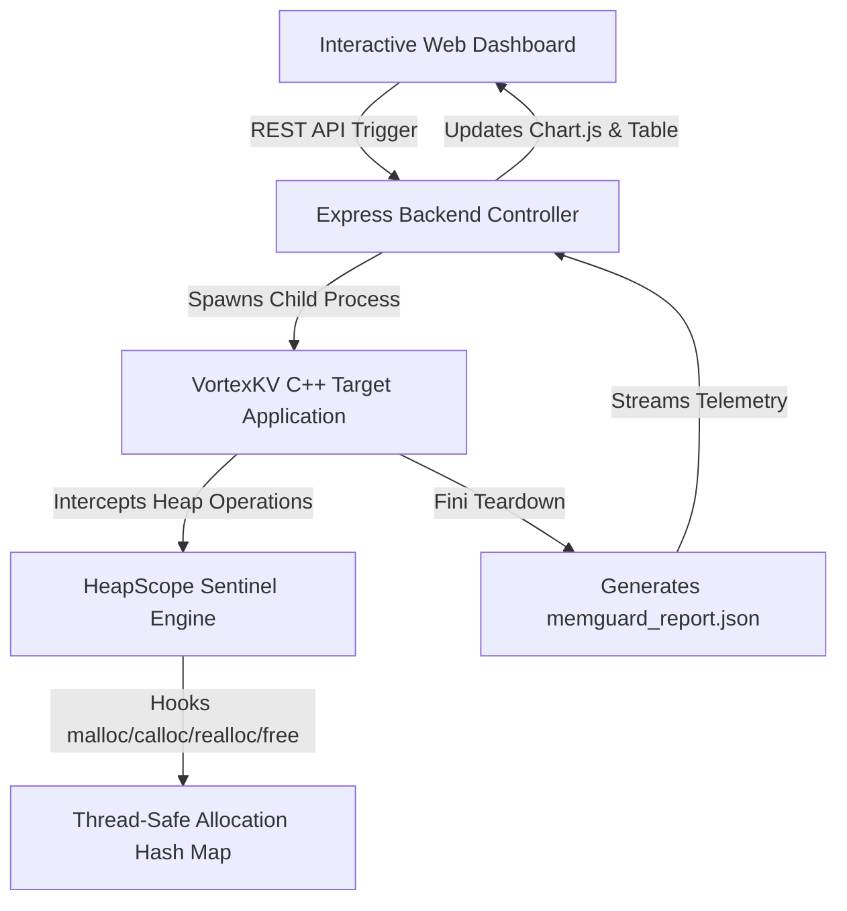

<div align="center">

# HeapScope
### Dynamic Runtime Memory Sentinel & Real-Time Leak Profiler

[](https://dashboard-neon-seven-49.vercel.app)
[](https://isocpp.org/)
[](https://nodejs.org/)
[](https://www.chartjs.org/)

<p align="center">
  An enterprise-grade runtime instrumentation toolchain that intercepts dynamic C/C++ heap allocations (<code>malloc</code>, <code>calloc</code>, <code>realloc</code>, <code>free</code>), pinpoints un-freed memory leaks with hexadecimal precision, and streams real-time diagnostic telemetry to a dynamic glassmorphism dashboard.
</p>

</div>

---

## ⚡ Highlights & Key Features

- **🔍 Full Runtime Interception:** Hooks into standard allocation routines via `MemGuardHook.hpp` without modifying application business logic.
- **📊 Precise Leak Attribution:** Tracks allocated memory sizes, originating caller function names, and exact hexadecimal stack/heap addresses.
- **🎯 Simulated Database Target (`VortexKV`):** Includes a custom high-throughput Key-Value C++ engine featuring realistic failure scenarios (session token orphans, cache expansion fragmentation, uncommitted transaction frames).
- **🖥️ Full-Stack Visual Dashboard:** Built with Node.js, Express, and Chart.js to dynamically trigger C++ execution pathways and plot memory consumption ratios in real time.
- **☁️ Cloud Simulation Architecture:** Automatically detects serverless environments (e.g., Vercel AWS Lambda containers) to provide deterministic runtime simulation when native C++ binaries cannot execute.

---

## 🏗️ System Architecture



---

## 🔬 Target Failure Scenarios (`VortexKV Engine`)

| Scenario | Subsystem | API Hooked | Failure Description | Leaked Memory |
| :--- | :--- | :--- | :--- | :--- |
| **`clean`** | High-Throughput Core | All APIs | 200 CRUD operations with 100% memory hygiene. | **0 Bytes** |
| **`session_leak`** | Session Auth Manager | `malloc` | Dropped network connections abandon client authentication tokens. | **3,840 Bytes** |
| **`cache_leak`** | Shard Cache Store | `realloc` | Resize exceptions leave dangling original shard buffers. | **20,480 Bytes** |
| **`transaction_leak`** | ACID Tx Engine | `calloc` | Batch rollback paths skip frame deallocation routines. | **5,120 Bytes** |
| **`all_leaks`** | Full Stress Test | All APIs | Triggers all subsystem bugs simultaneously for stress testing. | **29,440 Bytes** |

---

## 🚀 Quick Start Guide

### 1. Run Locally (Full C++ Compilation)
Prerequisites: **GCC / MinGW** (`g++`) and **Node.js v18+**.

```bash
# Clone repository
git clone https://github.com/YOUR_USERNAME/YOUR_REPO_NAME.git
cd cs204Project

# Install dashboard backend dependencies
cd dashboard
npm install

# Start local server (automatically compiles VortexKV.cpp on first run)
npm start
```
Open your browser to `http://localhost:3000` and interactively trigger memory profiling!

### 2. Manual Command-Line C++ Profiling
You can run the engine directly from terminal to inspect raw outputs:

```bash
# Compile target application with HeapScope hooks enabled
g++ -std=c++11 -O2 VortexKV.cpp -o VortexKV.exe

# Execute a leak scenario
./VortexKV.exe --scenario session_leak

# Inspect generated JSON telemetry
cat memguard_report.json
```

---

## 📁 Repository Structure

```text
├── MemGuardHook.hpp       # Core C++ header-only memory runtime interceptor
├── MemGuard.cpp           # Intel Pin dynamic binary instrumentation implementation
├── VortexKV.cpp           # Target Key-Value database server with leak simulations
├── dashboard/
│   ├── server.js          # Express API server & Vercel cloud simulation engine
│   ├── vercel.json        # Serverless routing configuration
│   └── public/            # Glassmorphism frontend UI (index.html, style.css, app.js)
├── memguard_report.json   # Auto-generated structured telemetry output
└── README.md              # Project documentation
```

---

